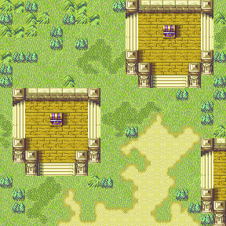
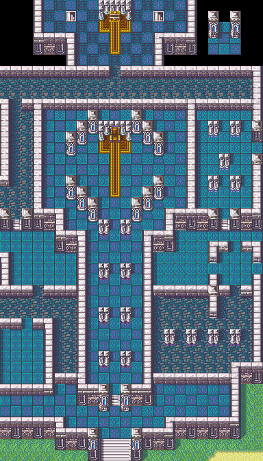
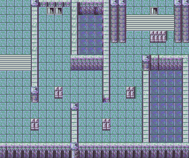
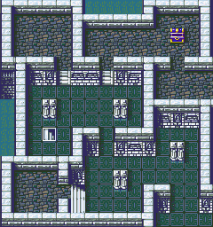
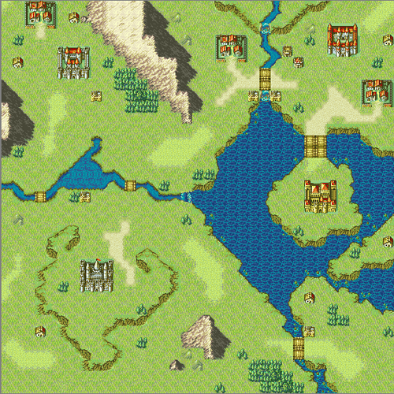
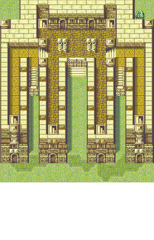
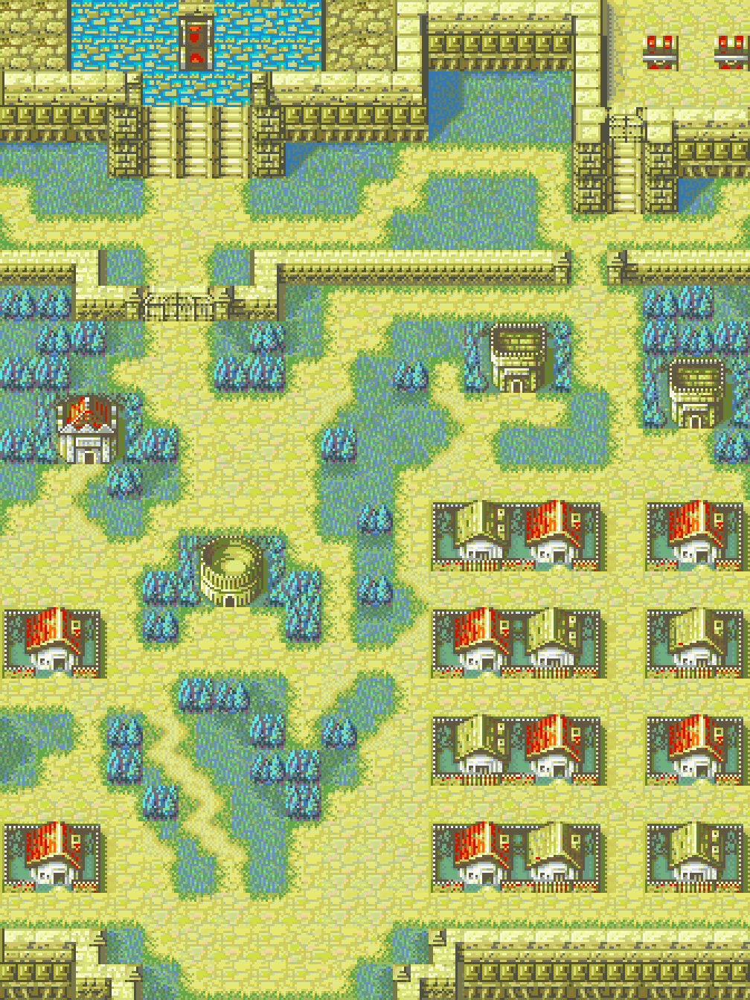
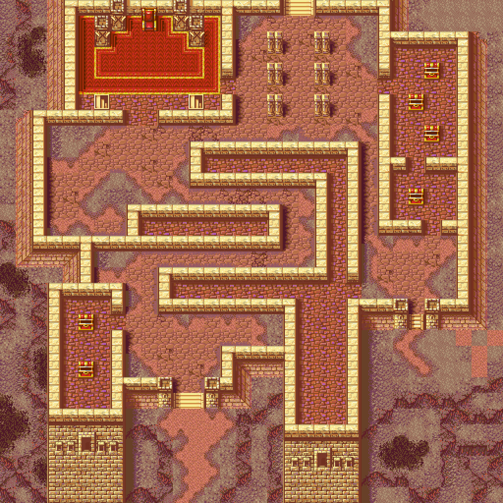
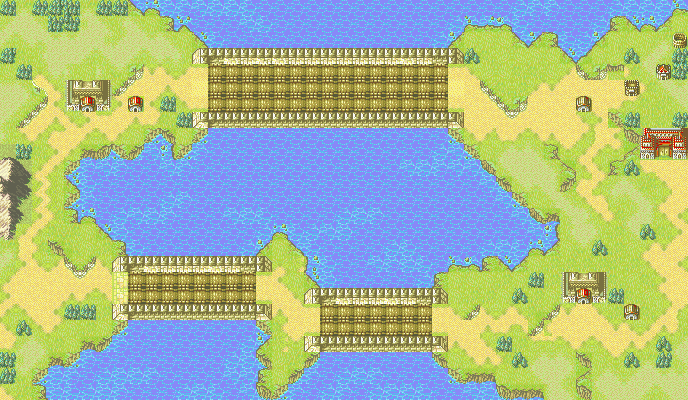
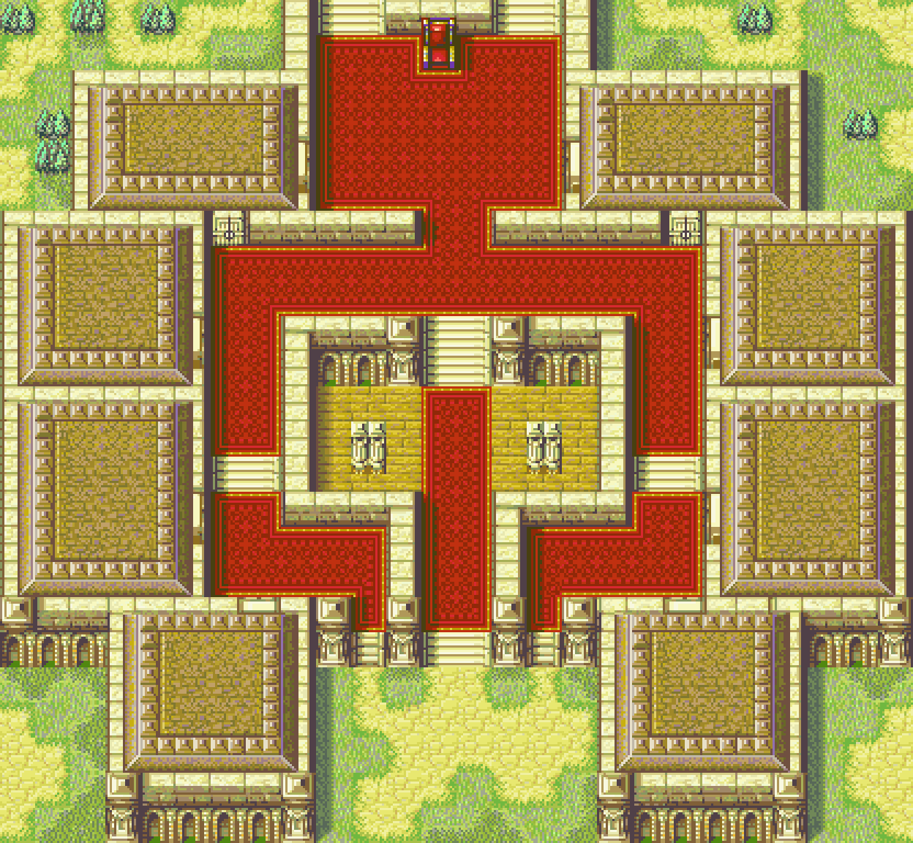

# Map Previews

Maps by Aura_Wolf

**Nobles_Evil_Doers_9_(5F_00_60_61)**  
[LT map .json file](./output/Nobles_Evil_Doers_9_(5F_00_60_61)__by_Aura_Wolf.json)  
__by_Aura_Wolf.png)

**Nobles_Evil_Doers_6_(6C_00_A3_6E)**  
[LT map .json file](./output/Nobles_Evil_Doers_6_(6C_00_A3_6E)__by_Aura_Wolf.json)  
__by_Aura_Wolf.png)

**Knights_Villagers_Bandits_4_(01_00_38_03)**  
[LT map .json file](./output/Knights_Villagers_Bandits_4_(01_00_38_03)__by_Aura_Wolf.json)  
__by_Aura_Wolf.png)

**Knights_Villagers_Bandits_10_(3C_00_CE_3E)**  
[LT map .json file](./output/Knights_Villagers_Bandits_10_(3C_00_CE_3E)__by_Aura_Wolf.json)  
__by_Aura_Wolf.png)

**Knights_Villagers_Bandits_13_(01_00_02_03)**  
[LT map .json file](./output/Knights_Villagers_Bandits_13_(01_00_02_03)__by_Aura_Wolf.json)  
__by_Aura_Wolf.png)

**Nobles_Evil_Doers_11_(3C_00_68_3E)**  
[LT map .json file](./output/Nobles_Evil_Doers_11_(3C_00_68_3E)__by_Aura_Wolf.json)  
__by_Aura_Wolf.png)

**Knights_Villagers_Bandits_11_(0E_00_72_10)**  
[LT map .json file](./output/Knights_Villagers_Bandits_11_(0E_00_72_10)__by_Aura_Wolf.json)  
__by_Aura_Wolf.png)

**Mages_Mercenaries_3_(42_00_43_44)**  
[LT map .json file](./output/Mages_Mercenaries_3_(42_00_43_44)__by_Aura_Wolf.json)  
__by_Aura_Wolf.png)

**Knights_Villagers_Bandits_6_(0E_00_72_10)**  
[LT map .json file](./output/Knights_Villagers_Bandits_6_(0E_00_72_10)__by_Aura_Wolf.json)  
__by_Aura_Wolf.png)

**Knights_Villagers_Bandits_7_(18_00_48_1A)**  
[LT map .json file](./output/Knights_Villagers_Bandits_7_(18_00_48_1A)__by_Aura_Wolf.json)  
__by_Aura_Wolf.png)

**Mages_Mercenaries_2_(01_00_38_03)**  
[LT map .json file](./output/Mages_Mercenaries_2_(01_00_38_03)__by_Aura_Wolf.json)  
__by_Aura_Wolf.png)

**Nobles_Evil_Doers_5_(6C_00_A3_6E)**  
[LT map .json file](./output/Nobles_Evil_Doers_5_(6C_00_A3_6E)__by_Aura_Wolf.json)  
__by_Aura_Wolf.png)

**Nobles_Evil_Doers_2_(01_00_4C_03)**  
[LT map .json file](./output/Nobles_Evil_Doers_2_(01_00_4C_03)__by_Aura_Wolf.json)  
__by_Aura_Wolf.png)

**Knights_Villagers_Bandits_9_(18_00_48_1A)**  
[LT map .json file](./output/Knights_Villagers_Bandits_9_(18_00_48_1A)__by_Aura_Wolf.json)  
__by_Aura_Wolf.png)

**Nobles_Evil_Doers_1_(18_00_19_1A)**  
[LT map .json file](./output/Nobles_Evil_Doers_1_(18_00_19_1A)__by_Aura_Wolf.json)  
__by_Aura_Wolf.png)

**Knights_Villagers_Bandits_2_(01_00_02_03)**  
[LT map .json file](./output/Knights_Villagers_Bandits_2_(01_00_02_03)__by_Aura_Wolf.json)  
__by_Aura_Wolf.png)

**Mages_Mercenaries_1_(0E_00_72_10)**  
[LT map .json file](./output/Mages_Mercenaries_1_(0E_00_72_10)__by_Aura_Wolf.json)  
__by_Aura_Wolf.png)

**Nobles_Evil_Doers_10_(88_00_89_8A)**  
[LT map .json file](./output/Nobles_Evil_Doers_10_(88_00_89_8A)__by_Aura_Wolf.json)  
__by_Aura_Wolf.png)

**Knights_Villagers_Bandits_5_(01_00_38_03)**  
[LT map .json file](./output/Knights_Villagers_Bandits_5_(01_00_38_03)__by_Aura_Wolf.json)  
__by_Aura_Wolf.png)

**Nobles_Evil_Doers_7_(6C_00_A3_6E)**  
[LT map .json file](./output/Nobles_Evil_Doers_7_(6C_00_A3_6E)__by_Aura_Wolf.json)  
__by_Aura_Wolf.png)

**Knights_Villagers_Bandits_3_(0E_00_72_10)**  
[LT map .json file](./output/Knights_Villagers_Bandits_3_(0E_00_72_10)__by_Aura_Wolf.json)  
__by_Aura_Wolf.png)

**Knights_Villagers_Bandits_8_(18_00_19_1A)**  
[LT map .json file](./output/Knights_Villagers_Bandits_8_(18_00_19_1A)__by_Aura_Wolf.json)  
__by_Aura_Wolf.png)

**Knights_Villagers_Bandits_1_(01_00_02_03)**  
[LT map .json file](./output/Knights_Villagers_Bandits_1_(01_00_02_03)__by_Aura_Wolf.json)  
__by_Aura_Wolf.png)

**Mages_Mercenaries_4_(01_00_02_03)**  
[LT map .json file](./output/Mages_Mercenaries_4_(01_00_02_03)__by_Aura_Wolf.json)  
__by_Aura_Wolf.png)

**Nobles_Evil_Doers_4_(6C_00_A3_6E)**  
[LT map .json file](./output/Nobles_Evil_Doers_4_(6C_00_A3_6E)__by_Aura_Wolf.json)  
__by_Aura_Wolf.png)

**Nobles_Evil_Doers_3_(01_00_02_03)**  
[LT map .json file](./output/Nobles_Evil_Doers_3_(01_00_02_03)__by_Aura_Wolf.json)  
__by_Aura_Wolf.png)

**Knights_Villagers_Bandits_12_(01_00_02_03)**  
[LT map .json file](./output/Knights_Villagers_Bandits_12_(01_00_02_03)__by_Aura_Wolf.json)  
__by_Aura_Wolf.png)

**Nobles_Evil_Doers_8_(6C_00_A3_6E)**  
[LT map .json file](./output/Nobles_Evil_Doers_8_(6C_00_A3_6E)__by_Aura_Wolf.json)  
__by_Aura_Wolf.png)

Maps by FEU

**Blyvern_FE8_3C003D3E_dlitzbicks**  
[LT map .json file](./output/Blyvern_FE8_3C003D3E_dlitzbicks__by_FEU.json)  

**Xenithiagen_FE8_1800481A_Thracia776Chapter24**  
[LT map .json file](./output/Xenithiagen_FE8_1800481A_Thracia776Chapter24__by_FEU.json)  

**Ukulele_FE8_8800898A_Blitz**  
[LT map .json file](./output/Ukulele_FE8_8800898A_Blitz__by_FEU.json)  

**Alusq_FE8_0A009B0C_in_the_dark**  
[LT map .json file](./output/Alusq_FE8_0A009B0C_in_the_dark__by_FEU.json)  

**Snakey1_FE8_01003803_Many_Castles**  
[LT map .json file](./output/Snakey1_FE8_01003803_Many_Castles__by_FEU.json)  

**Alusq_FE8_3C00CE3E_afro_comb_fort**  
[LT map .json file](./output/Alusq_FE8_3C00CE3E_afro_comb_fort__by_FEU.json)  

Maps by Shin19

**Chapter7OstiasRebellion_Diff_Tileset**  
[LT map .json file](./output/Chapter7OstiasRebellion_Diff_Tileset__by_Shin19.json)  

**Chapter12TheTrueEnemy_Fire_tileset_Minor_Changes**  
[LT map .json file](./output/Chapter12TheTrueEnemy_Fire_tileset_Minor_Changes__by_Shin19.json)  

**(7)Ch29x31xBattlePreparations_ArenaTime**  
[LT map .json file](./output/(7)Ch29x31xBattlePreparations_ArenaTime__by_Shin19.json)  
Ch29x31xBattlePreparations_ArenaTime__by_Shin19.png)

**Chapter13RescueMission_Diff_Tileset**  
[LT map .json file](./output/Chapter13RescueMission_Diff_Tileset__by_Shin19.json)  

**(7)Ch3BandofMercenaries_Diff_Tileset**  
[LT map .json file](./output/(7)Ch3BandofMercenaries_Diff_Tileset__by_Shin19.json)  
Ch3BandofMercenaries_Diff_Tileset__by_Shin19.png)

**Chapter6TheTrapIsSprung_More_Carpet**  
[LT map .json file](./output/Chapter6TheTrapIsSprung_More_Carpet__by_Shin19.json)  

**(7)Ch01_Diff_Tileset**  
[LT map .json file](./output/(7)Ch01_Diff_Tileset__by_Shin19.json)  
Ch01_Diff_Tileset__by_Shin19.png)

